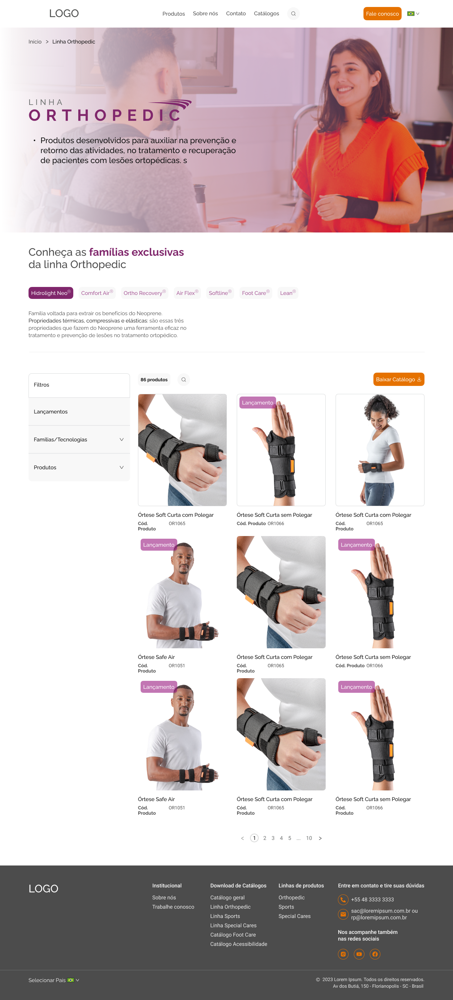

# Loja Orthopedic 🚀


## 🌟 Visão Geral

Bem-vindo(a) à **Loja Orthopedic**! Esta é uma **loja online especializada em produtos ortopédicos**, construída para fornecer uma experiência de compra digital eficiente e intuitiva. Seja para navegar por produtos, explorar diferentes categorias ou conhecer detalhes técnicos, este sistema transforma um catálogo físico em uma experiência digital moderna e bem estruturada.

A prioridade foi a **usabilidade**, a **manutenibilidade** e a **reutilização de código**, utilizando a potência do React com TypeScript para uma interface robusta e o Tailwind CSS para uma estilização consistente e responsiva.

## ✨ Destaques & Funcionalidades

*   🔄 **Componentes Reutilizáveis:** Arquitetura baseada em componentes com forte ênfase na reutilização e eliminação de duplicação de código (DRY).
*   🎣 **Hooks Personalizados:** Implementação de hooks customizados como `useCarousel` para compartilhamento de lógica entre componentes.
*   📱 **Design Responsivo:** Interface adaptável para mobile, tablet e desktop, garantindo uma experiência consistente em todos os dispositivos.
*   🛒 **Catálogo de Produtos:** Sistema completo para exibição de produtos com galeria de imagens, detalhes técnicos e informações de tamanho e cores.
*   🔍 **Navegação por Breadcrumbs:** Sistema de navegação hierárquica para melhor compreensão do usuário sobre sua localização na página.
*   🖼️ **Otimização de Imagens:** Redução de 50% no tamanho das imagens para melhor performance de carregamento.
*   🎨 **Design Consistente:** Uso uniforme de tipografia (Raleway e Roboto) e paleta de cores padronizada para uma identidade visual coesa.

---

## 🌐 Acessar o Projeto

Confira o projeto hospedado: [https://desafio-front-jade-nu.vercel.app/](https://desafio-front-jade-nu.vercel.app/)

---

## 🖼️ Visual

### Página Inicial


### Página de Produto


---

## 💻 Tech Stack

| Categoria | Tecnologia | Motivação |
| :---: | :---: | :--- |
| **Framework** | **React + TypeScript** | Componentização, tipagem estática e arquitetura modular. |
| **Estilização** | **Tailwind CSS** | Estilização utility-first e design responsivo. |
| **UI Components** | **shadcn/ui** | Componentes acessíveis e estilizáveis. |
| **Roteamento** | **React Router** | Navegação entre páginas com suporte a parâmetros. |
| **Build Tool** | **Vite** | Desenvolvimento rápido e build otimizado. |
| **Ícones** | **Lucide React** | Biblioteca de ícones consistentes e leves. |
| **Refatoração** | **Clean Architecture** | Código limpo, DRY e com baixo acoplamento. |

---

## 🛠️ Como Executar Localmente

Siga os passos abaixo para ter o projeto rodando em sua máquina:

### **Pré-requisitos**

Certifique-se de ter o **Node.js v18+** e **npm** instalados.

### **Instalação**

1.  **Clone ou baixe o repositório:**
    ```bash
    git clone <url-do-repositorio>
    cd loja-orthopedic
    ```

2.  **Instale as dependências:**
    ```bash
    npm install
    ```

3.  **Execute o servidor de desenvolvimento:**
    ```bash
    npm run dev
    ```

4.  **Acesse a Aplicação:**
    - Aplicação: `http://localhost:5173` (ou conforme indicado no terminal)

---

## 🗺️ Estrutura de Componentes

### Componentes Compartilháveis
* `ProductCard`: Componente único que exibe produtos tanto em grids quanto em carrosséis
* `Breadcrumb`: Componente para navegação hierárquica
* `ProductPagination`: Paginação customizada para listagem de produtos

### Hooks Personalizados
* `useCarousel`: Gerencia lógica de navegação em carrosséis
* `useResponsive`: Gerencia breakpoints responsivos
* `useSearchInput`: Gerencia estado e lógica de busca
* `useToggle`: Hook para alternância de estados (aberto/fechado)

### Páginas
* `HomePage`: Página inicial com hero, famílias de produtos e grid de produtos
* `ProductDetailPage`: Página de detalhe do produto com galeria, informações e produtos relacionados

---

## 🧹 Refatorações Realizadas

O projeto passou por uma série de refatorações para eliminar duplicação de código:

### 1. **Componente de Produto Unificado**
- **Antes**: Cards de produto duplicados em `RelatedProducts.tsx` e `ProductCard.tsx`
- **Depois**: Um único `ProductCard.tsx` com variantes para diferentes layouts

### 2. **Hooks Personalizados**
- **Criado**: `useCarousel.ts` para gerenciar lógica de carrossel em `RelatedProducts` e `ProductGallery`
- **Criado**: `useResponsive.ts` para lógica responsiva compartilhada
- **Criado**: `useSearchInput.ts` para gerenciamento de estado de busca

### 3. **Utilitários Compartilhados**
- **Criado**: Funções de utilidade como `createBreadcrumbItems` para padronizar breadcrumbs

### 4. **Consolidação de Paginação**
- **Renomeado**: `Pagination.tsx` para `ProductPagination.tsx` para evitar conflitos

---

## 👤 Autor

**[Henrique Guedes]**

[](https://github.com/henriqueguedes-developer)
[](https://www.linkedin.com/in/luishguedes/)